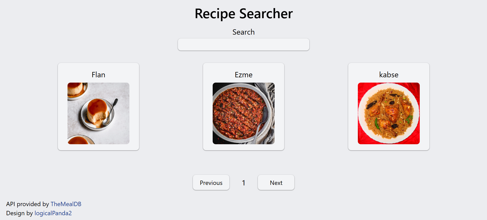

# Recipe Searcher



A simple, responsive and accessible recipe searcher.

## Table Of Contents
1. [Installation](#installation)
2. [Usage](#usage)
3. [Project Structure](#project-structure)
4. [Tech Stack](#tech-stack)
5. [Author](#author)
6. [License](#license)
7. [Special Thanks](#special-thanks)

## Installation
Copy and paste the commands below into a shell to install and set up the project (change &lt;target-directory&gt; to your actual target folder):
```
cd <target-directory>
git clone https://github.com/logicalPanda2/recipe-searcher-project.git
cd recipe-searcher-project
cd recipe-finder-api
npm install
```

## Usage
Type in `npm run dev` and press `o + Enter` to launch.

## Project Structure
```
/root (recipe-searcher-project)
    /assets -> images of finished product
    /scripts -> helper scripts
    /recipe-finder-api
        /src
```

## Tech Stack
- React.js
- Tailwind CSS
- TypeScript
- and HTML5, CSS, JS

## Author
Marcelino Romeo @logicalPanda2 (https://github.com/logicalPanda2)

## License
This project is licensed under the <a href="LICENSE.txt">MIT License</a>.

## Special Thanks
My deepest gratitude to <a href="https://www.themealdb.com/api.php">TheMealDB</a> for providing the API used in this project.